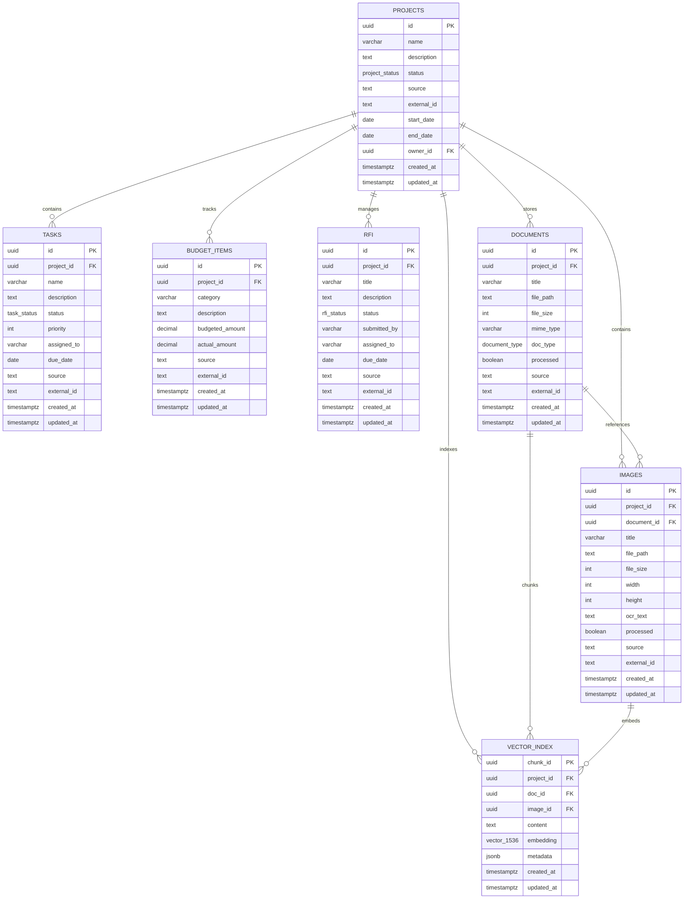

# Entity Relationship Diagram

```mermaid
erDiagram
    PROJECTS ||--o{ TASKS : contains
    PROJECTS ||--o{ BUDGET_ITEMS : tracks
    PROJECTS ||--o{ RFI : manages
    PROJECTS ||--o{ DOCUMENTS : stores
    PROJECTS ||--o{ IMAGES : contains
    PROJECTS ||--o{ VECTOR_INDEX : indexes
    
    DOCUMENTS ||--o{ IMAGES : references
    DOCUMENTS ||--o{ VECTOR_INDEX : chunks
    IMAGES ||--o{ VECTOR_INDEX : embeds
    
    PROJECTS {
        uuid id PK
        varchar name
        text description
        project_status status
        text source
        text external_id
        date start_date
        date end_date
        uuid owner_id FK
        timestamptz created_at
        timestamptz updated_at
    }
    
    TASKS {
        uuid id PK
        uuid project_id FK
        varchar name
        text description
        task_status status
        int priority
        varchar assigned_to
        date due_date
        text source
        text external_id
        timestamptz created_at
        timestamptz updated_at
    }
    
    BUDGET_ITEMS {
        uuid id PK
        uuid project_id FK
        varchar category
        text description
        decimal budgeted_amount
        decimal actual_amount
        text source
        text external_id
        timestamptz created_at
        timestamptz updated_at
    }
    
    RFI {
        uuid id PK
        uuid project_id FK
        varchar title
        text description
        rfi_status status
        varchar submitted_by
        varchar assigned_to
        date due_date
        text source
        text external_id
        timestamptz created_at
        timestamptz updated_at
    }
    
    DOCUMENTS {
        uuid id PK
        uuid project_id FK
        varchar title
        text file_path
        int file_size
        varchar mime_type
        document_type doc_type
        boolean processed
        text source
        text external_id
        timestamptz created_at
        timestamptz updated_at
    }
    
    IMAGES {
        uuid id PK
        uuid project_id FK
        uuid document_id FK
        varchar title
        text file_path
        int file_size
        int width
        int height
        text ocr_text
        boolean processed
        text source
        text external_id
        timestamptz created_at
        timestamptz updated_at
    }
    
    VECTOR_INDEX {
        uuid chunk_id PK
        uuid project_id FK
        uuid doc_id FK
        uuid image_id FK
        text content
        vector_1536 embedding
        jsonb metadata
        timestamptz created_at
        timestamptz updated_at
    }
```
